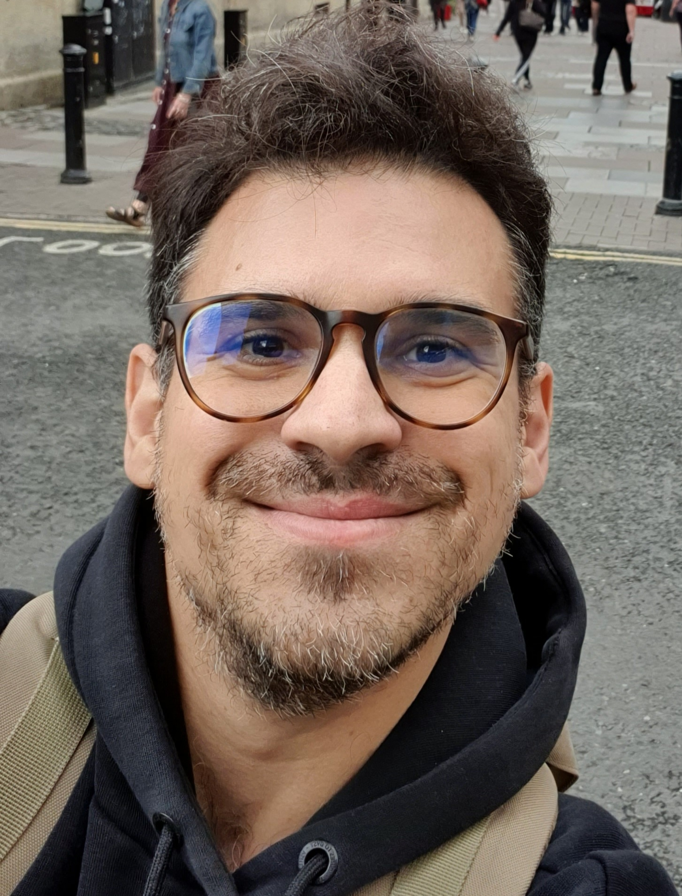

<!-- - - - - - - - - - - - - - - - -->

<!-- <h3> Othonas Moultos </h3> -->
 

<strong>
Associate Professor, <a href="https://www.tudelft.nl/3me/over/afdelingen/process-energy/people/engineering-thermodynamics/">Engineering Thermodynamics</a>  Department of <a href="hhttps://www.tudelft.nl/3me/over/afdelingen/process-energy">Process & Energy</a>,  Faculty of <a href="https://www.tudelft.nl/3me/">Mechanical Engineering</a>,  <a href="http://www.tudelft.nl/">Delft University of Technology</a>.</strong>

<!-- Before joining TU Delft, I was a research scientist at the <a href="https://www.qatar.tamu.edu/programs/chemical-engineering">Chemical Engineering Program</a> of Texas A&M University at Qatar in the group of <a href="https://www.qatar.tamu.edu/programs/chemical-engineering/faculty-and-staff/dr.-ioannis-economou">Prof. Ioannis Economou</a> working on molecular modeling of chemical mixtures relevant to CCUS proccesses. In 2014, I spent time as a postdoc in the group of <a href="https://cbe.princeton.edu/people/athanassios-panagiotopoulos">Prof. Athanassios Panagiotopoulos</a> at <a href="https://cbe.princeton.edu">Princeton University</a>. In 2013, I obtained a PhD in Physical Chemistry of Polymers from the <a href="https://www.uoi.gr/en/">University of Ioannina</a> supervised by <a href="https://chem.uoi.gr/en/meli-dep/vlachos-konstantinos/">Prof. Costas Vlahos</a>. In 2008, I graduated with an Engineering Diploma in <a href="http://www.materials.uoi.gr/en/">Materials Engineering</a> from the same university. -->

Before joining TU Delft, I worked as a postdoc on molecular modeling of chemical mixtures relevant to CCUS proccesses under the supervision of <a href="https://www.qatar.tamu.edu/programs/chemical-engineering/faculty-and-staff/dr.-ioannis-economou">Prof. Ioannis Economou</a> (<a href="https://www.qatar.tamu.edu/programs/chemical-engineering">Chem. Eng. TAMUQ</a>, Qatar) and <a href="https://cbe.princeton.edu/people/athanassios-panagiotopoulos">Prof. Athanassios Panagiotopoulos</a> (<a href="https://cbe.princeton.edu">Chem. Eng. Princeton</a>, USA). In 2013, I obtained a PhD in Physical Chemistry of Polymers from <a href="https://www.uoi.gr/en/">UOI</a>, Greece (supervisor <a href="https://chem.uoi.gr/en/meli-dep/vlachos-konstantinos/">Prof. Costas Vlahos</a>). In 2008, I graduated with an Engineering Diploma in <a href="http://www.materials.uoi.gr/en/">Materials Engineering</a> from the same university. My academic family tree can be seen <a href="https://neurotree.org/beta/tree.php?pid=741534">here</a>.

<h5>My research in a nutshell</h5>

<!-- Fossil fuels not only harm the environment but are also becoming more and more expensive as the resources are slowly getting depleted or due to (geo)political reasons. I believe that technologies for producing sustainable energy are the only way to move forward, and the challenging role of engineers is to devise and optimize such technologies.  -->
My research and teaching activities revolve around the application of molecular thermodynamics to Process & Energy Engineering in order to accelarate the transition to a more sustainabl future. I currently focus on two research lines: 
(i) I investigate hydrogen storage, purification and transportation, and environmentally-friendly solvents for carbon dioxide capture and utilization. 
(ii) I work towards designing sustainable adsorbents for the removal of contaminants from water. My work requires large-scale high-performance computing and involves a number of powerful molecular simulation methods such as on-the-fly calculations of thermodynamic and transport properties of fluids using molecular dynamics, and phase-, adsorption- and reaction-equilibria using advanced Monte Carlo sampling. My research aims to provide insight at both the fundamental and the application level. To achieve this, I collaborate with partners such as <a href="https://totalenergies.com">TotalEnergies</a>, <a href="https://cyclopure.com">Cyclopure</a>, <a href="https://www.waternet.nl">Waternet</a>, <a href="https://www.witteveenbos.com"> Witteveen & Bos</a>, <a href="https://hyethydrogen.com">HyET Hydrogen</a>, <a href="https://sites.google.com/xintcglobal.com/xintcglobal">XiNTC</a>, <a href="https://www.tno.nl/nl/">TNO</a>, <a href="https://www.dmt-et.com">DMT Environmental Tech</a>, and various universities and research institutes around the world.

  <a href="assets/misc/MScGuide.pdf"><strong>Download here</strong></a> the practical guide for MSc theses that I wrote together with <a href="https://www.linkedin.com/in/carey-walters-44252714b/?originalSubdomain=nl"><strong>Carey Walters</strong></a>. 

 

 PhD position open: 
  <a href="https://www.tudelft.nl/over-tu-delft/werken-bij-tu-delft/vacatures/details/?nPostingId=4211&nPostingTargetId=11873&id=QEZFK026203F3VBQBLO6G68W9&LG=UK&mask=external"><strong>Computational design of adsorbents for the removal of micropollutants from water</strong></a>. 

 

<!-- alert-primary : blue-->
<!-- alert-info : light blue-->

 <a href="https://thermodynamics2024.org"><strong>Registrations </strong></a>for the 28th Thermodynamics Conference (Delft, 4-6 September 2024) are now open.

 

 
      
  
 
<!-- 
 -->

<h6>  Address</h6>
Building 34K - Office 0.250 
Leeghwaterstraat 39 
2628CB Delft 
The Netherlands

  
<h6>  Phone</h6>
+ 31 (0) 15 27 81 307
  
<h6>  e-mail</h6>
o.moultos@tudelft.nl

  
<h6> <a href="https://github.com/omoultosEthTuDelft"> github</a> </h6>

<h6> <a href="https://scholar.google.ca/citations?user=r6fFwkQAAAAJ&hl=en"> scholar</a> </h6>

<h6> <a href="https://nl.linkedin.com/in/othonas-moultos-498585a9?trk=profile-badge"> Linkedin</a> </h6>

<h6> <a target="_blank" href="https://www.researchgate.net"> ResearchGate</a> </h6>

<!-- <h6> <a href="https://www.researchgate.net/profile/Othon-Moultos/2"> ResearchGate</a> </h6> -->

 <!-- 
      

     

  
-->
  

 
<!-- - - - - - - - - - - - - - - - -->
<h5>News</h5>

    

    

    <!-- 
 -->

<section markdown="1">

- July 2023: New paper in Polymers: [Chemical Feedback in Templated Reaction-Assembly of Polyelectrolyte Complex Micelles: A Molecular Simulation Study of the Kinetics and Clustering](https://www.mdpi.com/2073-4360/15/14/3024).
- July 2023: The new paper by Bin Fang in JCED is chosen as ACS Editors' Choice: [Solubilities and Self-Diffusion Coefficients of Light n-Alkanes in NaCl Solutions at the Temperature Range (278.15–308.15) K and Pressure Range (1–300) bar and Thermodynamics Properties of Their Corresponding Hydrates at (150–290) K and (1–7000) bar](https://pubs.acs.org/doi/full/10.1021/acs.jced.3c00225).
- July 2023: Welcome to [Dimitris Mintsis](https://www.linkedin.com/in/dimitris-mintsis-39a158209/?originalSubdomain=gr) who joined the group for his MSc thesis in collaboration with TATA STEEL.
- June 2023: Jelle received the [best pitch/poster price](https://www.linkedin.com/search/results/content/?fromMember=%5B%22ACoAADduMTIB9TST9L7P_0rmi5zV-zWAq8e1CWA%22%5D&heroEntityKey=urn%3Ali%3Afsd_profile%3AACoAADduMTIB9TST9L7P_0rmi5zV-zWAq8e1CWA&keywords=vladimir%20jelle%20lagerweij&position=0&searchId=c1e3c074-4898-477b-9b11-7eac36007c4e&sid=Eau&update=urn%3Ali%3Afs_updateV2%3A(urn%3Ali%3Aactivity%3A7075506794894118912%2CBLENDED_SEARCH_FEED%2CEMPTY%2CDEFAULT%2Cfalse)) for the Honours projects in our entire faculty!!! Many congrats!  
- June 2023: [Hugo van Leeuwen](https://www.linkedin.com/in/hjvleeuwen/) has joined the group for this MSc thesis with TATA STEEL.
- June 2023: New paper in Int. J. Hydrogen Energy: [Transient modelling of a multi-cell alkaline electrolyzer for gas crossover and safe system operation](https://www.sciencedirect.com/science/article/pii/S0360319923025259).
- May 2023: Otto received the prestigious <a href="https://ppeppd.org/awards/">Young Researcher Award</a> at the <a href="https://ppeppd.org/ppeppd2023/">PPEPPD 2024</a> conference in Tarragona, Spain!
- April 2023: New paper by Mert in JCTC: [Solving Chemical Absorption Equilibria using Free Energy and Quantum Chemistry Calculations: Methodology, Limitations, and New Open-Source Software](https://pubs.acs.org/doi/full/10.1021/acs.jctc.3c00144).
- April 2023: Otto was mentioned in the [news of the Faculty](https://www.tudelft.nl/2023/3me/nieuws/othon-moultos-ontvangt-nwo-otp-subsidie-van-1-miljoen-euro-voor-onderzoek-naar-waterbehandeling).
- March 2023: Otto has been awarded an [NWO OTP grant of 1 million euros](https://www.nwo.nl/en/news/seven-projects-get-green-light-through-open-technology-programme) to study cyclodextrin-based adsorbents for the removal of PFAS and other micropollutants in water. More details to follow!
- March 2023: New paper in Fuel from Bin Fang is out: [Effects of nanobubbles on methane hydrate dissociation: A molecular simulation study](https://www.sciencedirect.com/science/article/pii/S0016236123008438?via%3Dihub#s0065).
- First paper of 2023 is out: [Interfacial Tensions, Solubilities, and Transport Properties of the H2/ H2O/NaCl System: A Molecular Simulation Study](https://pubs.acs.org/doi/10.1021/acs.jced.2c00707?ref=pdf).
- December 2022: Casper succesfully defended his MSc! Congrats.
- November 2022: 3 new papers out!!! 
[Electrochemical Reduction of CO2 to Oxalic Acid: Experiments, Process Modeling, and Economics](https://pubs.acs.org/doi/10.1021/acs.iecr.2c02647), [A New Force Field for OH– for Computing Thermodynamic and Transport Properties of H2 and O2 in Aqueous NaOH and KOH Solutions](https://pubs.acs.org/doi/10.1021/acs.jpcb.2c06381), [Solubility of CO2 in Aqueous Formic Acid Solutions and the Effect of NaCl Addition: A Molecular Simulation Study](https://pubs.acs.org/doi/10.1021/acs.jpcc.2c05476).
- November 2022: Welcome to new MSc student Camiel Grevet!
- September 2022: A warm welcome to the new MSc students Jose and Jelle. 
- September 2022: Our review paper [A review on nature-inspired gating membranes: from concept to design and applications](https://aip.scitation.org/doi/10.1063/5.0105641) is accepted in Journal of Chemical Physics.
- August 2022: Two papers accepted in Fluid Phase Equilibria: [Is Stokes-Einstein relation valid for the description of intra-diffusivity of hydrogen and oxygen in liquid water?](https://www.sciencedirect.com/science/article/pii/S0378381222001893)  and [Transport Properties of Mixtures of Acid Gases with Aqueous Monoethanolamine Solutions: A Molecular Dynamics Study](https://www.sciencedirect.com/science/article/pii/S0378381222002072?via%3Dihub).
- July 30th: Our new paper [Hydrogen dissociation in Li-decorated borophene and borophene hydride: An ab-initio study](https://www.sciencedirect.com/science/article/pii/S0169433222018566) in Applied Surface Science is now online.
- June 13th: Mate succesfully defended his PhD "Molecular simulation of nanoporous materials: Application to metal organic frameworks, zeolites, and cyclodextrins", and is now a Dr. Congrats!
- May 30th: Today Hirad succesfully defended his PhD "Molecular simulation of Deep Eutectic Solvents" and is officially a Dr!!! Many congrats Hirad.
- May 6th: Our new paper [Solubilities and Transport Properties of CO2, Oxalic Acid, and Formic Acid in Mixed Solvents Composed of Deep Eutectic Solvents, Methanol, and Propylene Carbonate](https://pubs.acs.org/doi/10.1021/acs.jpcb.2c01425) in the Journal of Physical Chemistry B is now online.
- May 4th: Our new paper [Electro-osmotic Drag and Thermodynamic Properties of Water in Hydrated Nafion Membranes from Molecular Dynamics](https://pubs.acs.org/doi/10.1021/acs.jpcc.2c01226?ref=pdf) in the Journal of Physical Chemistry C is now online.
- April 19th: The "Introduction to Molecular Simulation" course is starting today (<a href="https://brightspace.tudelft.nl/d2l/home/400948">Brightspace page</a>).
- April 2022: The Mechanical Engineering of TU Delft is ranked 4th according to the 2021 QS Rankings. <a href="https://www.tudelft.nl/en/about-tu-delft/facts-and-figures/tu-delft-in-international-rankings/subject-rankings"> More details here</a> (for TU Delft employees).
- February 2022: Welcome to the group <a href="https://www.linkedin.com/in/caspervandergeest/?originalSubdomain=nl"> Casper</a>! 
- September 2021: Otto is featured as an Emerging Investigator in the Journal of Chemical Physics with the article <a href="https://aip.scitation.org/doi/full/10.1063/5.0062408">Vapor pressures and vapor phase compositions of choline chloride urea and choline chloride ethylene glycol deep eutectic solvents from molecular simulation</a>, which is also featured as an Editor's pick. <a href="https://www.tudelft.nl/2021/tu-delft-process-technology-institute/dr-othon-moultos-is-featured-as-an-emerging-investigator-in-the-journal-of-chemical-physics">Short story here</a>.
- July 2021: Our article on the <a href="https://pubs.acs.org/doi/10.1021/acs.jced.1c00300?ref=pdf">diffusivities of hydrogen and oxygen in water</a> is selected as Editor's choice in ACS Journal of Chemical and Engineering Data. 
- March 2021: Our article on the <a href="https://pubs.acs.org/doi/10.1021/acs.jced.1c00020?ref=pdf">thermodynamic properties of compressed hydrogen/water mixtures</a> is selected as Editor's choice in ACS Journal of Chemical and Engineering Data. 

</section>
    

<!-- 

<a class="twitter-timeline" data-width="300" data-height="500" href="https://twitter.com/kAsterios?ref_src=twsrc%5Etfw">Tweets by Asterios</a> 

 -->

    

  

  

