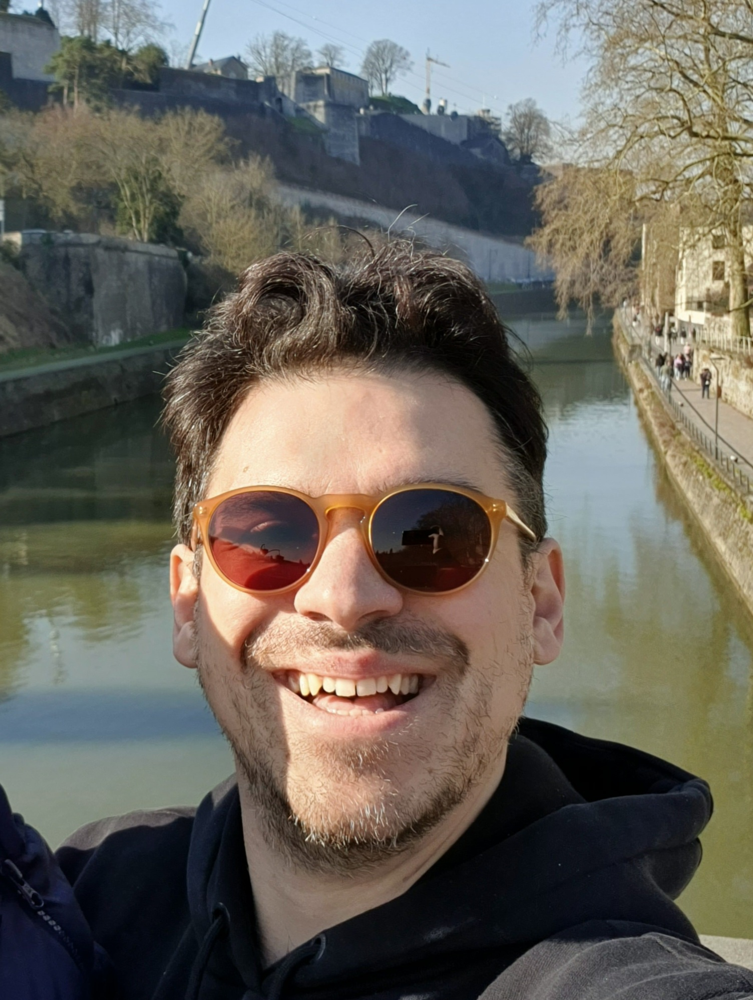

<!-- - - - - - - - - - - - - - - - -->

<!-- <h3> Othonas Moultos </h3> -->

<strong>
Assistant Professor, <a href="https://www.tudelft.nl/3me/over/afdelingen/process-energy/people/engineering-thermodynamics/">Engineering Thermodynamics</a>. Department of <a href="hhttps://www.tudelft.nl/3me/over/afdelingen/process-energy">Process & Energy</a>, <a href="https://www.tudelft.nl/3me/">Mechanical Engineering Faculty</a>, <a href="http://www.tudelft.nl/">Delft University of Technology</a>.</strong>

Before joining TU Delft, I was a research scientist at the <a href="https://www.qatar.tamu.edu/programs/chemical-engineering">Chemical Engineering Program</a> of Texas A&M University at Qatar in the group of <a href="https://www.qatar.tamu.edu/programs/chemical-engineering/faculty-and-staff/dr.-ioannis-economou">Prof. Ioannis Economou</a> working on molecular modeling of chemical mixtures relevant to CCUS proccesses. In 2014, I spent time as a postdoc in the group of <a href="https://cbe.princeton.edu/people/athanassios-panagiotopoulos">Prof. Athanassios Panagiotopoulos</a> at <a href="https://cbe.princeton.edu">Princeton University</a>. In 2013, I obtained a PhD in Physical Chemistry of Polymers from the <a href="https://www.uoi.gr/en/">University of Ioannina</a> supervised by <a href="https://chem.uoi.gr/en/meli-dep/vlachos-konstantinos/">Prof. Costas Vlahos</a>. In 2008, I graduated with an Engineering Diploma in <a href="http://www.materials.uoi.gr/en/">Materials Engineering</a> from the same university.

<h5>My research</h5>

Fossil fuels not only cause significant harm to the environment but are also becoming more and more expensive to produce as the resources are slowly getting depleted or due to political reasons. I strongly believe that technologies for producing sustainable energy are the only way to move forward, and the challenging role of engineers is to devise and optimize such technologies. My research and teaching activities revolve around the application of molecular thermodynamics to Process & Energy Engineering in order to accelarate the transition to a more sustainabl future. I currently focus on two research lines: 
(i) The energy line, in which I investigate hydrogen storage, purification and transportation, and environmentally-friendly solvents for carbon dioxide capture and utilization. 
(ii) The process line, in which I study sustainable adsorbents for the removal of contaminants from water. My work requires large-scale high-performance computing and involves a number of powerful molecular simulation methods such as on-the-fly calculations of thermodynamic and transport properties of fluids using molecular dynamics, and phase-, adsorption- and reaction-equilibria using advanced Monte Carlo sampling. My research aims to provide insight at both the fundamental and the application level. To achieve this, I actively collaborate with partners such as <a href="https://totalenergies.com">TotalEnergies</a>, <a href="https://hyethydrogen.com">HyET Hydrogen</a>, <a href="https://sites.google.com/xintcglobal.com/xintcglobal">XiNTC</a>, <a href="https://www.tno.nl/nl/">TNO</a>, and <a href="https://www.dmt-et.com">DMT Environmental Tech</a>.

<!-- 

  I am searching for motivated **postdocs, PhD students and research engineers**! More information on the positions <a href="/jobs/">here</a>. 

 -->

<!-- <h5>Postdocs</h5>
<section markdown="1">
- [Marios Fragkoulis](http://mariosfragkoulis.gr)
- [Rihan Hai](https://scholar.google.de/citations?user=vD8M9R0AAAAJ&hl=en) 
</section> -->

<h5>PhD Students</h5>
<section markdown="1">
- [Máté Erdös](https://scholar.google.com/citations?user=TOKYbtYAAAAJ&hl=en)
- [Hirad Seyed Salehi](https://scholar.google.com/citations?user=_zAZdskAAAAJ&hl=en) 
- [Mert Polat](https://scholar.google.com/citations?user=iNQ80VEAAAAJ&hl=en)
- [Parsa Habibi](https://www.tudelft.nl/3me/over/afdelingen/process-energy/people/engineering-thermodynamics/parsa-habibi) 
</section>

 
      
  
<!-- 
 -->
<h6>  e-mail</h6>
o.moultos@tudelft.nl
  
<h6>  Address</h6>
Building 34K - Office 0.250 
Leeghwaterstraat 39 
2628CB Delft 
The Netherlands

<!-- - - - - - - - - - - - - - - - -->

    

    

<h5>News</h5>

<section markdown="1">
- 
- September 2021: Otto is featured as an <a href="https://www.tudelft.nl/2021/tu-delft-process-technology-institute/dr-othon-moultos-is-featured-as-an-emerging-investigator-in-the-journal-of-chemical-physics">Emerging Investigator in the Journal of Chemical Physics</a> with the article <a href="https://aip.scitation.org/doi/full/10.1063/5.0062408">Vapor pressures and vapor phase compositions of choline chloride urea and choline chloride ethylene glycol deep eutectic solvents from molecular simulation</a>, which is also featured as an Editor's pick!

</section>
    

<!-- 

<a class="twitter-timeline" data-width="300" data-height="500" href="https://twitter.com/kAsterios?ref_src=twsrc%5Etfw">Tweets by Asterios</a> 

 -->

    

  

  

