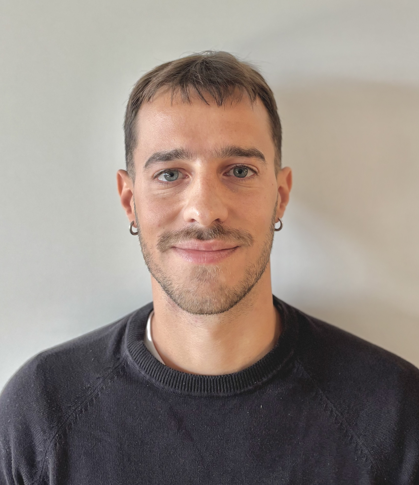
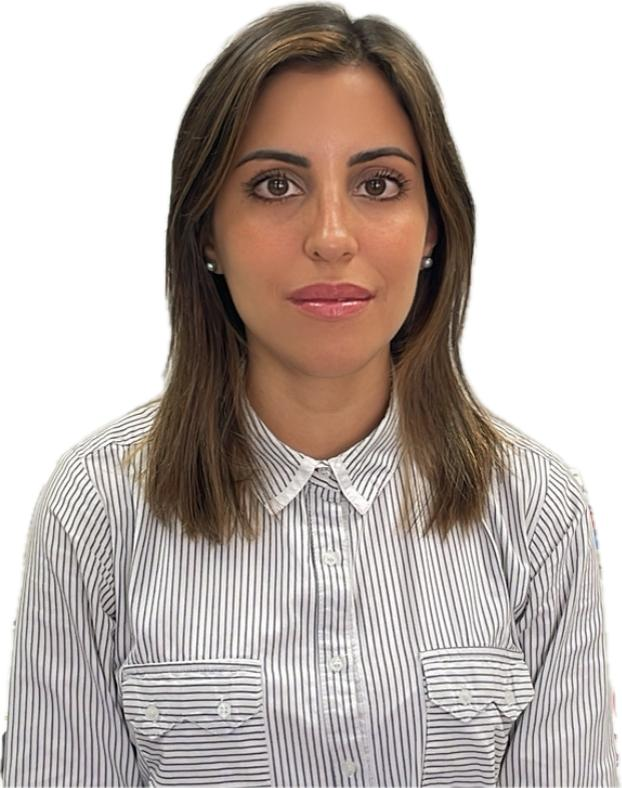
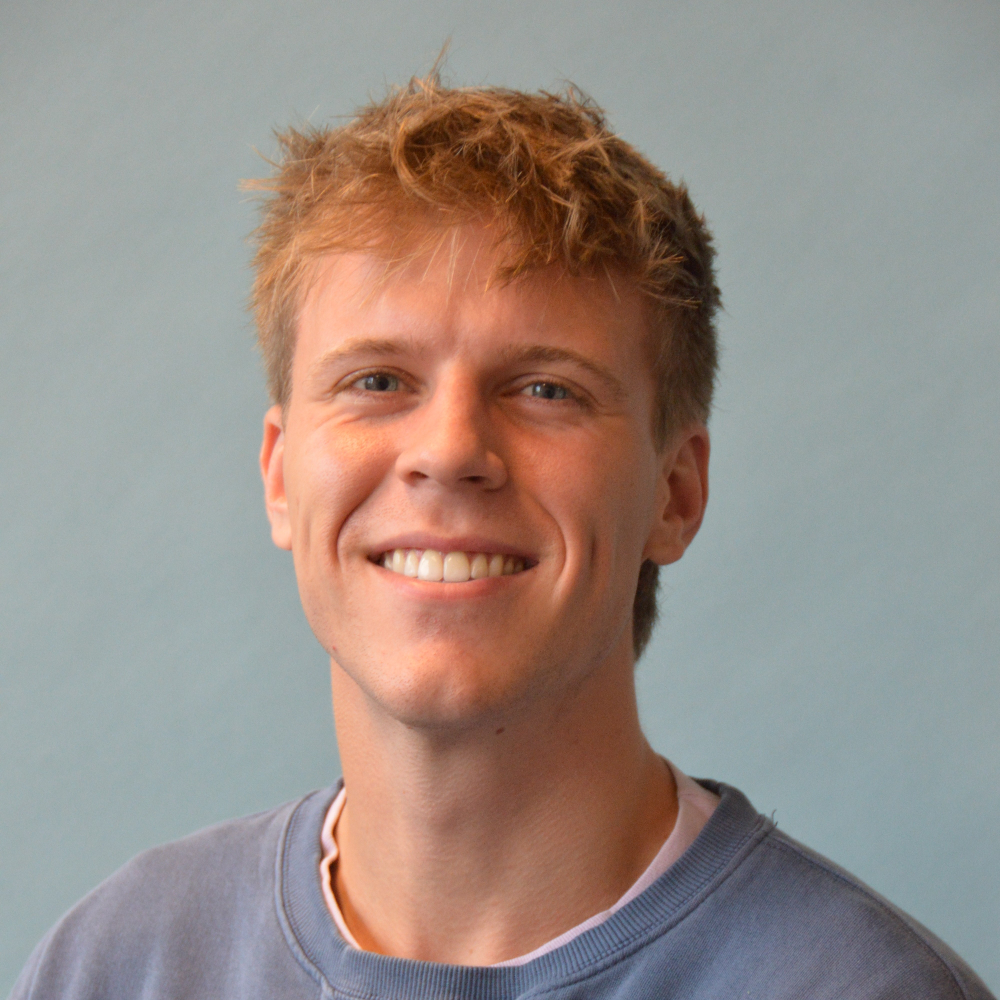
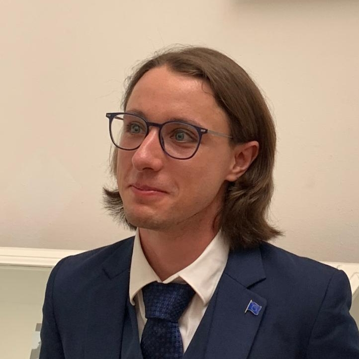
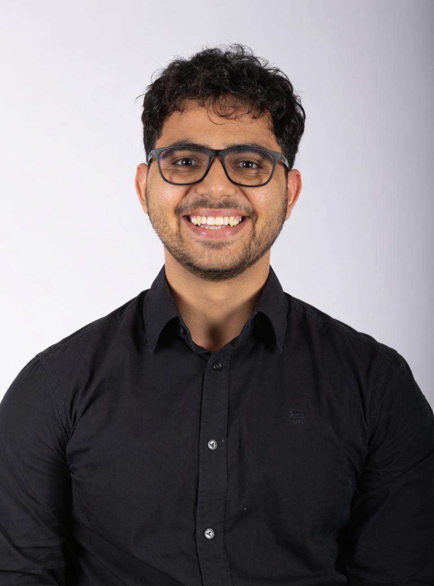

  

<h5>PhD students</h5>

  

    

      
      
<a href="https://www.linkedin.com/in/kostaspsillos/">Konstantinos Psillos</a>

      
Molecular simulation of membranes for electrochemical hydrogen systems

      
Promotors: Otto Moultos, <a href="https://thijsvlugt.github.io/website/">Thijs Vlugt</a>, Mahinder Ramdin

    

  

  

    

      
      
Paula De Barros Barreto

      
Molecular simulation of carbon dioxide-rich mixtures adsorption onto nanoporous materials

      
Dual degree PhD (BR/NL). Promotors: Otto Moultos, <a href="https://thijsvlugt.github.io/website/">Thijs Vlugt</a>, <a href="https://www.linkedin.com/in/marcelo-castier-757740270/?originalSubdomain=py">Marcelo Castier</a>, <a href="https://portal.edat.unicamp.br/perfil?origem=programas&docente=311804&sigla_unidade=&nome_unidade=&nome_programa=%20Pós-Graduação%20da%20Faculdade%20de%20Engenharia%20Química">Luis Mercier Franco</a> (<a href="https://unicamp.br/en/unicamp/faculdade-de-engenharia-quimica/">Unicamp, Brazil</a>)

    

  

  

    

      
      
<a href="https://www.linkedin.com/mynetwork/grow/">Bowen Sha</a>

      
Molecular modeling of PFAS removal with novel cyclodextrin-based adsorbents

      
Promotors: Otto Moultos, <a href="https://thijsvlugt.github.io/website/">Thijs Vlugt</a>

    

  

  

    

      
      
<a href="https://www.linkedin.com/in/cole-brzakala/">Cole Brzakala</a>

      
Artificial Intelligence to accelerate molecular simulations for design of PFAS absorbents

      
Promotors: Otto Moultos, <a href="https://www.tudelft.nl/citg/over-faculteit/afdelingen/watermanagement/medewerker/universitair-docent-onderwijzer/dr-riccardo-taormina">Riccardo Taormina</a> (<a href="https://www.tudelft.nl/citg">CITG TU Delft</a>)

    

  

  

    

      
      
<a href="https://www.linkedin.com/in/vladimir-jelle-lagerweij-21654021b/?originalSubdomain=nl">Vladimir Jelle Lagerweij</a>

      
Machine learning and molecular modeling of aqueous electrolyte solutions

      
Promotors: Otto Moultos, <a href="https://thijsvlugt.github.io/website/">Thijs Vlugt</a>

    

  

 
<h5>MSc students</h5>

  

    

      
      
<a href="https://www.linkedin.com/in/sarvesh-mahadevan-8362491b3/">Sarvesh Mahadevan</a>

      
Development of a digital thread of a Liquid Hydrogen tank integrating Thermo-Structural analysis

      
w/ <a href="https://www.tudelft.nl/en/staff/f.orefice.1/">Dr. Francesco Orefice</a>

    

  

  

    

      
      
Gabriele Blasi

      
Molecular Simulation of Nanoporous Materials for PFAS Adsorption

    

  

  

    

      
      
Omkar Dhavale

      
Thermodynamic modeling and molecular simulation of Molten-Salt Fuel Systems

      
w/ Dr. Anna Smith (Reactor Institute)

    

  

  

    

      
      
Sieds Lykles

      
Boltzmann generators for molecular systems

      
w/ <a href="https://www.tudelft.nl/ewi/over-de-faculteit/afdelingen/applied-mathematics/people/dr-a-alexander-heinlein">Dr. Alexander Heinlein</a>

    

  

  

    

      
      
Theodoros Benai

      
Molecular Simulation of Activated Carbons for PFAS capture

    

  

  

    

      
      
Hicham Hachicho

      
Hydrogen liquefaction in confined media

      
w/ Dr. Mahinder Ramdin

    

  

  

    

      
      
Kasper van Tulder

      
Modelling of plasma chemistry for integration in CFD: focus on transport properties

      
w/ Dr. Anna Felden (main supervisor)

    

  

  
<h5>Interns</h5>
<section markdown="1">

- [Tim Deutman]() <strong>Evaluating and Summarizing Operational and Safety Protocols for Electrolyzer Modules</strong>, w/ [XINTC](https://xintc.global).

</section>

<!-- Photo Lightbox Modal -->

  

    

      

        
      

    

  

