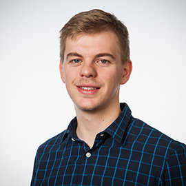

<h5>PhD students</h5>

<section markdown="1">
<!-- -   -->

- [Mert Polat](https://scholar.google.com/citations?user=iNQ80VEAAAAJ&hl=en), <strong>Molecular simulation of VLE curves of acid gas adsorption in liquids</strong>, w/  <a href="https://totalenergies.com"> TotalEnergies</a> and <a href="https://www.armines.net/fr/centres-de-recherche-departements-thematiques/énergétique-et-génie-des-procédés/centre"> CTP MINES ParisTech</a>.
- [Parsa Habibi](https://www.tudelft.nl/3me/over/afdelingen/process-energy/people/engineering-thermodynamics/parsa-habibi), <strong>Computational discovery of hydrogen storage materials</strong>, w/  <a href="https://www.tudelft.nl/staff/p.dey/?cHash=cac0dd30bb433e38fe36e9f04fb3bbbf"> Dr. Poulumi Dey</a>, <a href="https://www.tudelft.nl/en/3me/about/departments/materials-science-and-engineering/"> MSE TU Delft</a>.
- In the context of collaboration, I am currently supervising [Lili Ma](https://www.linkedin.com/in/lili-ma-94e/?originalSubdomain=nl) ([Pavement Engineering/CiTG](https://www.tudelft.nl/citg/over-faculteit/afdelingen/engineering-structures/sections-labs/pavement-engineering), supervisors [Dr. Katerina Varveri](https://www.tudelft.nl/citg/over-faculteit/afdelingen/engineering-structures/sections-labs/pavement-engineering/staff/dr-katerina-varveri) and [Prof. Sandra Erkens](https://www.tudelft.nl/citg/over-faculteit/afdelingen/engineering-structures/sections-labs/pavement-engineering/staff/profdrir-mjg-sandra-erkens)) on <strong>Molecular simulation of bitumen</strong>, [Willemijn van Rooijen](https://www.linkedin.com/in/willemijn-van-rooijen-46398a151/?originalSubdomain=nl) ([Reservoir Engineering/CiTG](https://www.tudelft.nl/citg/over-faculteit/afdelingen/geoscience-engineering/sections/reservoir-engineering), supervisor [Dr. Hadi Hajibeygi](https://www.tudelft.nl/citg/over-faculteit/afdelingen/geoscience-engineering/sections/reservoir-engineering/staff/academic-staff/dr-h-hadi-hajibeygi)) on <strong>Interfacial and thermophysical properties of mixtures relevant to subsurface hydrogen storage</strong>, and [Sebastian Price](https://porelab.no/2020/09/03/wecome-to-sebastian/) ([PoreLab NTNU](https://porelab.no), supervisors [Prof. Signe Kjelstrup](https://www.ntnu.no/ansatte/signe.kjelstrup) and [Dr. Anders Lervik](https://www.ntnu.edu/employees/anders.lervik)) on <strong>Modeling the ultrasound mediated transport of nanoparticles in tissue</strong>.
</section>

<h5>MSc students</h5>
<section markdown="1">

- [Ke Xu]() <strong>Transport properties of aqueous electrolyte soutions relevant to water electrolysis</strong>, w/  <a href="https://www.tudelft.nl/staff/p.dey/?cHash=cac0dd30bb433e38fe36e9f04fb3bbbf"> Dr. Poulumi Dey</a>, <a href="https://www.tudelft.nl/en/3me/about/departments/materials-science-and-engineering/"> MSE TU Delft</a>.
- [Casper van der Geest](https://www.linkedin.com/in/caspervandergeest/?originalSubdomain=nl) <strong>Molecular simulations of mixtures of amines with acid gases</strong>.
- [Laya Roustazadeh](https://www.qatar.tamu.edu/news-and-events/news/2020/06/24/texas-a-and-m-at-qatar-names-outstanding-graduates/) <strong>Adsoprtion of gas mixtures in Metal Organic Frameworks</strong>, w/ [Prof. Ioannis Economou](https://www.qatar.tamu.edu/programs/chemical-engineering/faculty-and-staff/dr.-ioannis-economou), [TAMUQ](https://www.qatar.tamu.edu).

 
</section>

<h5>BSc students</h5>
<section markdown="1">
	
- BEP group: B. Sari, T. Ruijgrok, R. Hendrickx, O. Granata, <strong>Making a simple and efficient water purification system</strong>, w/  <a href="https://www.tudelft.nl/3me/over/afdelingen/process-energy/people/engineering-thermodynamics/hanieh-bazyar"> Dr. Hanieh Bazyar</a>
</section>

