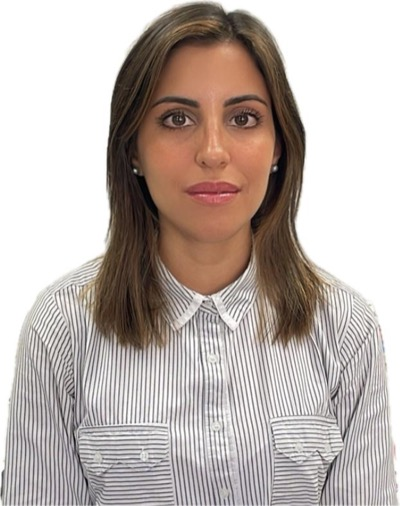
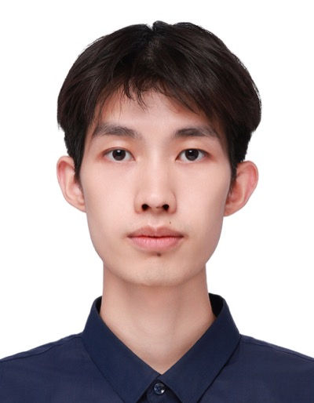
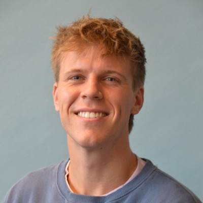
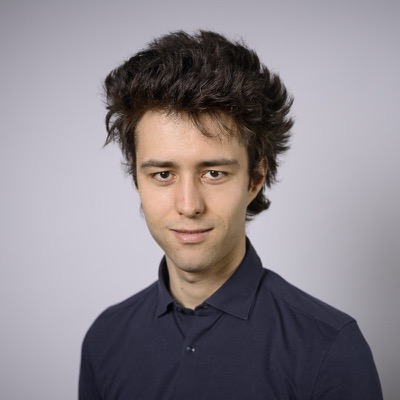
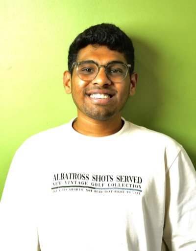
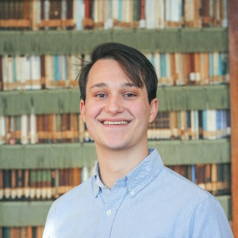
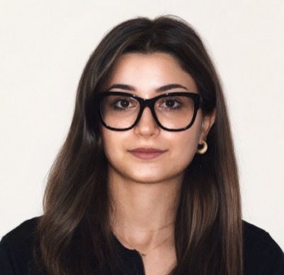
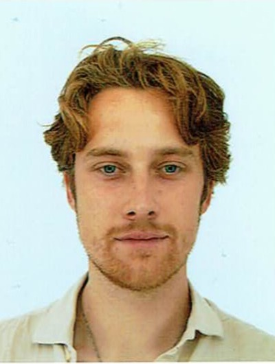

  

<h3>PhD students</h3>

  

    

      
      
<a href="https://careers.tudelft.nl/job/Delft-PhD-Position-Molecular-Modeling-of-Hydrogen-Production-Processes-2628-CD/1363992057/">PhD position open &mdash; apply here</a>

      
Molecular Modeling of Hydrogen Production Processes

    

  

  

    

      
      
Gabriele Blasi

      
HARMony project

      
Starting soon. Promotors: Otto Moultos, <a href="https://research.wur.nl/en/persons/costas-nikiforidis/">Costas Nikiforidis</a>

    

  

  

    

      
      
Paula De Barros Barreto

      
Molecular simulation of carbon dioxide-rich mixtures adsorption onto nanoporous materials

      
Dual degree PhD (BR/NL). Promotors: Otto Moultos, <a href="https://thijsvlugt.github.io/website/">Thijs Vlugt</a>, <a href="https://www.linkedin.com/in/marcelo-castier-757740270/?originalSubdomain=py">Marcelo Castier</a>, <a href="https://portal.edat.unicamp.br/perfil?origem=programas&docente=311804&sigla_unidade=&nome_unidade=&nome_programa=%20Pós-Graduação%20da%20Faculdade%20de%20Engenharia%20Química">Luis Mercier Franco</a> (<a href="https://unicamp.br/en/unicamp/faculdade-de-engenharia-quimica/">Unicamp, Brazil</a>)

    

  

  

    

      
      
<a href="https://www.linkedin.com/in/bowen-sha-5223982a5/">Bowen Sha</a>

      
Molecular modeling of PFAS removal with novel cyclodextrin-based adsorbents

      
Promotors: Otto Moultos, <a href="https://thijsvlugt.github.io/website/">Thijs Vlugt</a>

    

  

  

    

      
      
<a href="https://www.linkedin.com/in/cole-brzakala/">Cole Brzakala</a>

      
Artificial Intelligence to accelerate molecular simulations for design of PFAS absorbents

      
Promotors: Otto Moultos, <a href="https://www.tudelft.nl/citg/over-faculteit/afdelingen/watermanagement/medewerker/universitair-docent-onderwijzer/dr-riccardo-taormina">Riccardo Taormina</a> (<a href="https://www.tudelft.nl/citg">CITG TU Delft</a>), <a href="https://www.linkedin.com/in/jan-peter-van-der-hoek-770aaba/">Jan Peter van der Hoek</a>

    

  

  

    

      
      
<a href="https://www.linkedin.com/in/vladimir-jelle-lagerweij-21654021b/?originalSubdomain=nl">Vladimir Jelle Lagerweij</a>

      
Machine learning and molecular modeling of aqueous electrolyte solutions

      
Promotors: Otto Moultos, <a href="https://thijsvlugt.github.io/website/">Thijs Vlugt</a>

    

  

<h3>MSc students</h3>

  

    

      
      
<a href="https://www.linkedin.com/in/sarvesh-mahadevan-8362491b3/">Sarvesh Mahadevan</a>

      
Development of a digital thread of a Liquid Hydrogen tank integrating Thermo-Structural analysis

      
w/ <a href="https://www.tudelft.nl/en/staff/f.orefice.1/">Dr. Francesco Orefice</a>

    

  

  

    

      
      
Sieds Lykles

      
Boltzmann generators for molecular systems

      
w/ <a href="https://www.tudelft.nl/ewi/over-de-faculteit/afdelingen/applied-mathematics/people/dr-a-alexander-heinlein">Dr. Alexander Heinlein</a>

    

  

  

    

      
      
Theodoros Benai

      
Molecular Simulation of Activated Carbons for PFAS capture

    

  

  

    

      
      
Tim Deutman

      
Integrating a Physically-Informed Digital Twin for Modular Alkaline Water Electrolysis

      
w/ <a href="https://xintc.global">XINTC</a>

    

  

  

    

      
      
Alessia Bisconti

      
Study of the kinetic limitations in LMFP and LFP batteries using ICI and EIS

      
in collaboration with <a href="https://www.psi.ch">Paul Scherrer Institute</a>, Switzerland

    

  

  

    

      
      
Arno Soetens

      
Generative data for training machine learning algorithms based on molecular simulations

    

  

<h3>Interns</h3>
<section markdown="1">

- [Alex Collet]() <strong>Development of Equations of State from Machine Learning Potentials</strong>, w/ [Prof. Erich A. Müller](https://www.imperial.ac.uk/people/e.muller), [Imperial College London](https://www.imperial.ac.uk/chemical-engineering).

</section>

<!-- Photo Lightbox Modal -->

  

    

      

        
      

    

  

