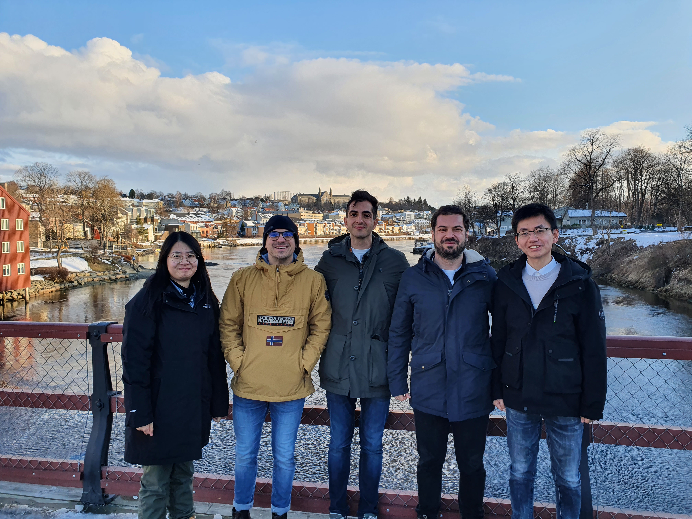
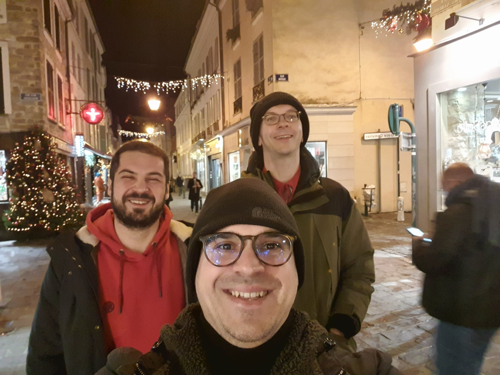
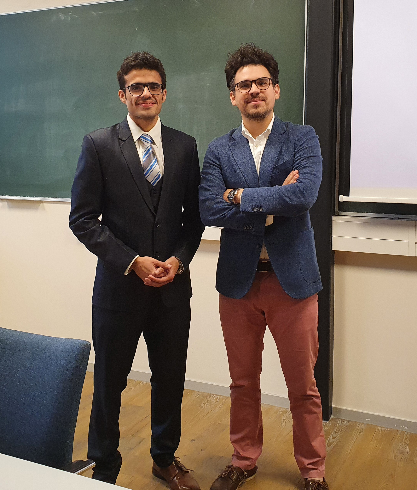
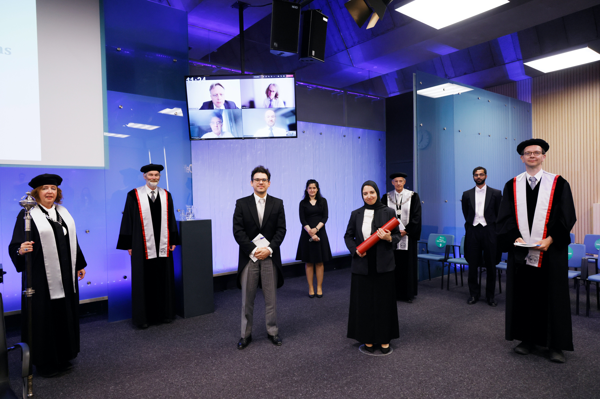

<html>
<head>

</head>
<body>

  
  
From our visit to Porelab/NTNU. People from left to right: Ke Xu, Otto, Parsa Habibi, Mert Polat, Bin Fang (Trondheim, April 2022)

  
  
Oostport, Delft (Delft, January 2022)

  
  
With Mert and Thijs from our visit at CTP MINES ParisTech (Fountainbleu, France, Dec 2021)

  
  
MSc gratuation of Kunal Mavani (TU Delft, July 2021)

  
  
PhD Defence of Noura Dawass (TU Delft, June 2021)

</body>
</html>