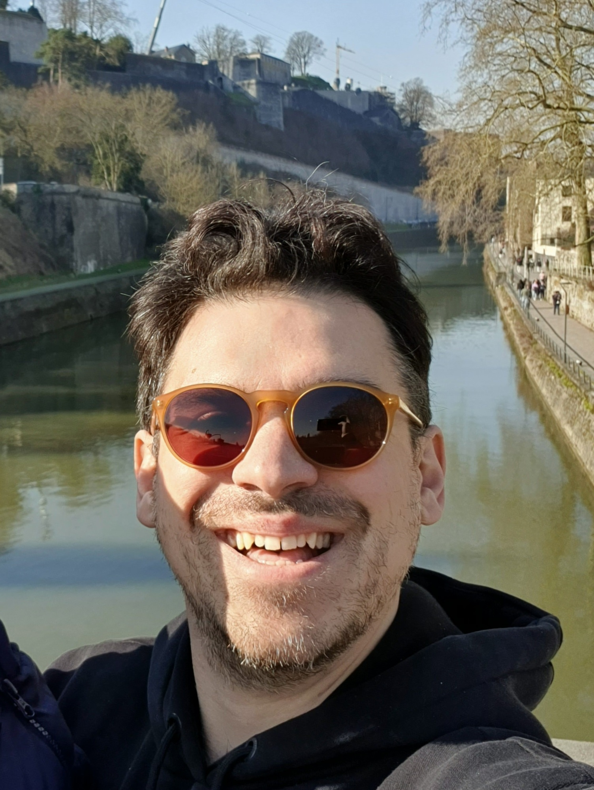

 
 

 Oostport, Delft (Delft, January 2022) 

  
  

 With Mert and Thijs from our visit at CTP MINES ParisTech (Fountainbleu, France, Dec 2021) 

  
     <!--    --> 
 

 MSc gratuation of Kunal Mavani (TU Delft, July 2021) 

  
     <!--    --> 
 

 PhD Defence of Noura Dawass (TU Delft, June 2021) 

  
     <!--    --> 
 

 From our visit to Porelab/NTNU names  (Trondheim, April 2022) 

  

