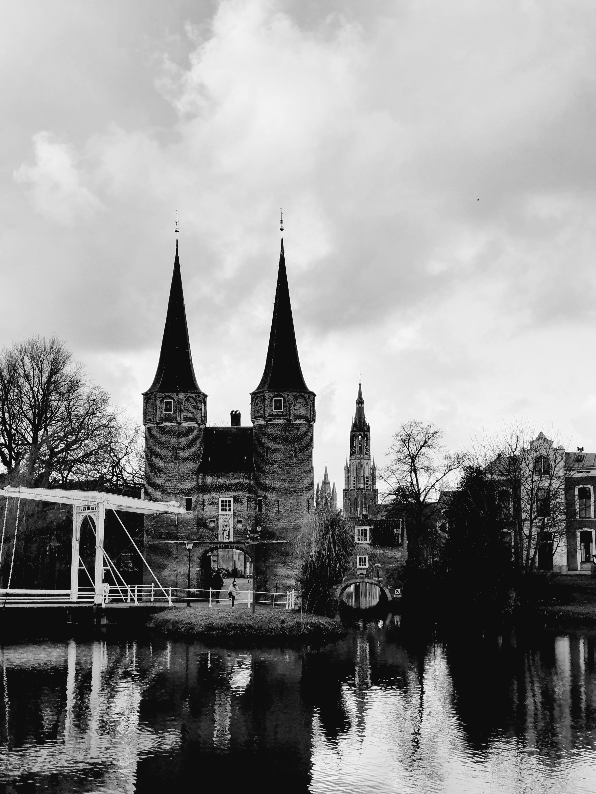

<html>
<head>

</head>
<body>

<!-- 
 -->
 

  
  
From our visit to Porelab/NTNU. People from left to right: Ke Xu, Otto, Parsa Habibi, Mert Polat, Bin Fang (Trondheim, Norway, April 2022)

  
  
Oostport, Delft (Delft, January 2022)

  
  
With Mert Polat and Thijs Vlugt from our visit at CTP MINES ParisTech (Fountainbleu, France, Dec 2021)

  
  
MSc gratuation of Kunal Mavani (TU Delft, July 2021)

  
  
PhD Defence of Noura Dawass (TU Delft, June 2021)

  
  
From our visit to TAMUQ: In Souq Waqif with Thijs Vlugt and Noura Dawass (Doha, Qatar, November 2019)

  
  
With Peter van den Broeke under the Acropolis (Athens, Greece, July 2019)

  
  
Lunch during the Thermodynamics 2019 conference. People from left to right: Ioannis Tsimpanogiannis, Ioannis Economou, Claire McCabe, Peter Cummings, Amparo Galindo, Chrisa Economou, Otto, Ilias Nikolaidis (Punta Umbria, Spain, June 2019)

  
  
With Thijs Vlugt outside Notre Dame a few days before the fire broke out (Paris, France, April 2019)

  
  
From our visit to Porelab/NTNU. People from left to right: Otto, Signe Kjelstrup, Thijs Vlugt, Michael Rauter, Dick Bedeaux, Olav Galteland, Bjørn Hafskjold (Trondheim, Norway, March 2019)

  
  
With Keichi Kuboyama and Noura Dawass from our visit to Porelab/NTNU. (Trondheim, Norway, March 2019)

  
  
With Max Döpke (left) and Máté Erdös (right) from our visit to UCL (London, September 2018)

  
  
MSc gratuation of Zsolt Csaszar (TU Delft, October 2017)

  
  
From our visit to Universidad Pablo de Olavide. People from left to right: Otto, Remco Hartkamp, Christos Bardas, Hirad Salehi, Seyed Jamali (Sevilla, Spain, October 2017)

  
  
With Máté Erdös (left) and Reza Rahbari (right) during the outing of Process & Energy department at the beach (Kijkduin, The Hague, June 2017)

  
  
At the Indiana dunes state park with lake Michigan in the background (Indiana, USA, June 2016)

  
  
At the TAMUQ campus with (from left to rigth) Ioannis Tsimpanogiannis, Panagiotis Krokidas, and Nikos Diamantonis (Doha, Qatar, March 2016)

<!-- 
 -->

</body>
</html>