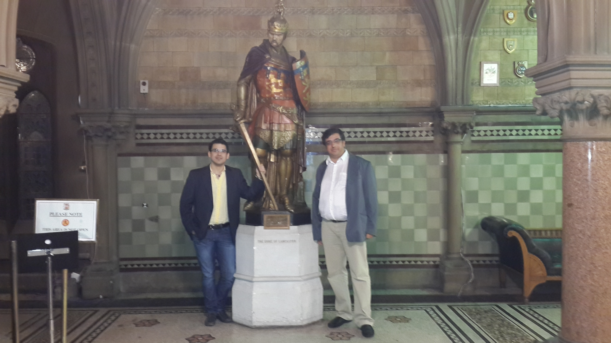

<html>
<head>

</head>
<body>

<!-- 
 -->
 

  
  
 At the <a href="https://www.romanbaths.co.uk">Roman Baths</a> during the Thermodynamics 2022 conference in Bath. People from left to right: <a href="https://www.qatar.tamu.edu/programs/chemical-engineering/faculty-and-staff/dr.-ioannis-economou">Ioannis Economou</a>, <a href="https://orbit.dtu.dk/en/persons/georgios-kontogeorgis">Georgios Kontogeorgis</a>, Chrysa Economou, <a href="h=https://orbit.dtu.dk/en/persons/nefeli-effrosyni-novak">Nefeli Novak</a>, Otto, and Parsa Habibi (Bath, UK, September 2022)

  
  
 MSc graduation of Ke Xu (TU Delft, July 2022)

  
  
 PhD defence of Máté Erdös (TU Delft, June 2022)

  
  
 Making vanilla ice cream together with Thijs Vlugt at the farewell event of our dean Theun Baller. Recipe: 1 lt of milk, 1 lt of cream, 350 g of sugar, 0.5 bottle of vanilla extract, and ...liquid nitrogen. (TU Delft, June 2022)

  
  
MSc graduation of Prateek Jain (TU Delft, June 2022)

  
  
PhD Defence of Hirad Salehi (TU Delft, June 2022)

  
  
Ice cream afternoon for the group! People from left to right: Ke Xu, Lili Ma, Mert Polat, Parsa Habibi, Casper van der Geest, Prateek Jain, Poulumi Dey. Front row: Seyed Jamali, Otto, and Alexandros (Delft, May 2022)

  
  
From our visit to Porelab/NTNU. People from left to right: Ke Xu, Otto, Parsa Habibi, Mert Polat, Bin Fang (Trondheim, Norway, April 2022)

  
  
Oostport, Delft (Delft, January 2022)

  
  
With Mert Polat and Thijs Vlugt from our visit at CTP MINES ParisTech (Fountainbleu, France, Dec 2021)

  
  
MSc gratuation of Kunal Mavani (TU Delft, July 2021)

  
  
PhD Defence of Noura Dawass (TU Delft, June 2021)

  
  
From our visit to TAMUQ: In Souq Waqif with Thijs Vlugt and Noura Dawass (Doha, Qatar, November 2019)

  
  
With Peter van den Broeke under the Acropolis (Athens, Greece, July 2019)

  
  
Lunch during the Thermodynamics 2019 conference. People from left to right: Ioannis Tsimpanogiannis, Ioannis Economou, Claire McCabe, Peter Cummings, Amparo Galindo, Chrisa Economou, Otto, Ilias Nikolaidis (Punta Umbria, Spain, June 2019)

  
  
With Thijs Vlugt outside Notre Dame a few days before the fire broke out (Paris, France, April 2019)

  
  
From our visit to Porelab/NTNU. People from left to right: Otto, Signe Kjelstrup, Thijs Vlugt, Michael Rauter, Dick Bedeaux, Olav Galteland, Bjørn Hafskjold (Trondheim, Norway, March 2019)

  
  
With Keichi Kuboyama and Noura Dawass from our visit to Porelab/NTNU. (Trondheim, Norway, March 2019)

  
  
With Max Döpke (left) and Máté Erdös (right) from our visit to UCL (London, UK, September 2018)

  
  
Outside the P&E buidling experiencing rare weather phenomena! (TU Delft, December 2017)

  
  
MSc gratuation of Zsolt Csaszar (TU Delft, October 2017)

  
  
From our visit to Universidad Pablo de Olavide. People from left to right: Otto, Remco Hartkamp, Christos Bardas, Hirad Salehi, Seyed Jamali (Sevilla, Spain, October 2017)

  
  
At the ESAT 2017 conference in Scotland (Edinburgh, UK, September 2017)

  
  
With Máté Erdös (left) and Reza Rahbari (right) during the outing of Process & Energy department at the beach (Kijkduin, The Hague, June 2017)

  
  
At the Indiana dunes state park with lake Michigan in the background (Indiana, USA, June 2016)

  
  
At the TAMUQ campus with (from left to rigth) Ioannis Tsimpanogiannis, <a href="https://www.linkedin.com/in/panagiotis-krokidas-b2907a89/">Panagiotis Krokidas</a>, and <a href="https://www.linkedin.com/in/researchchemicalengineer/">Nikos Diamantonis</a> (Doha, Qatar, March 2016)

  
  
 At the ESAT 2015 conference in Greece. People from left to right: <a href="https://www.linkedin.com/in/marianna-yiannourakou-4765a65/">Marianna Yiannourakou</a>, Ioannis Tsimpanogiannis, <a href="https://scholar.google.gr/citations?hl=en&user=8MjGyYwAAAAJ&view_op=list_works&sortby=pubdate">Georgios Boulougouris</a>, Otto, <a href="https://www.linkedin.com/in/ilias-nikolaidis-931554205/">Ilias Nikolaidis</a>, <a href="https://www.linkedin.com/in/vasileios-michalis-54301148/">Vasilis Michalis</a>, Zoi Makrodimitri, <a href="https://inn.demokritos.gr/person/loukas-d-peristeras/">Loukas Peristeras</a>, <a href="https://www.qatar.tamu.edu/programs/chemical-engineering/faculty-and-staff/dr.-ioannis-economou">Ioannis Economou</a>, and <a href="https://inn.demokritos.gr/person/niki-vergadou/">Niki Vergadou</a> (Athens, Greece, June 2015)

  
  
 AZP group dinner. People from left to right: Mike Howard, Joey Vella, Arash Nikoubashman, AZP, Mirjana Zoric, Nate Mahynski, Zoltan Mester, Andrew Santos, Kevin Daly, Gustavo Orozco, Otto (Princeton NJ, Usa, June 2014)

  
  
Playing basketball with colleagues <a href="https://www.linkedin.com/in/zoltan-mester-4636a810/">Zoltan Mester</a> and <a href="https://www.linkedin.com/in/andrew-p-santos/">Andrew Santos</a> (Princeton NJ, Usa, May 2014)

<!-- 

  
  
 New York City (Manhattan, NY, August 2014)

 -->

  
  
An afternoon at the Sandia Peak during the <a href="https://www.lammps.org/workshops/Aug13/Aug13_workshop.html">LAMMPS Users' Workshop and Symposium</a> (Albuquerque NM, USA, September 2013)

  
  
Thermodynamics 2013 conference dinner at Manchester's city hall with Ioannis Tsimpanogiannis (Manchester, UK, September 2013)

<!-- 
 -->

</body>
</html>