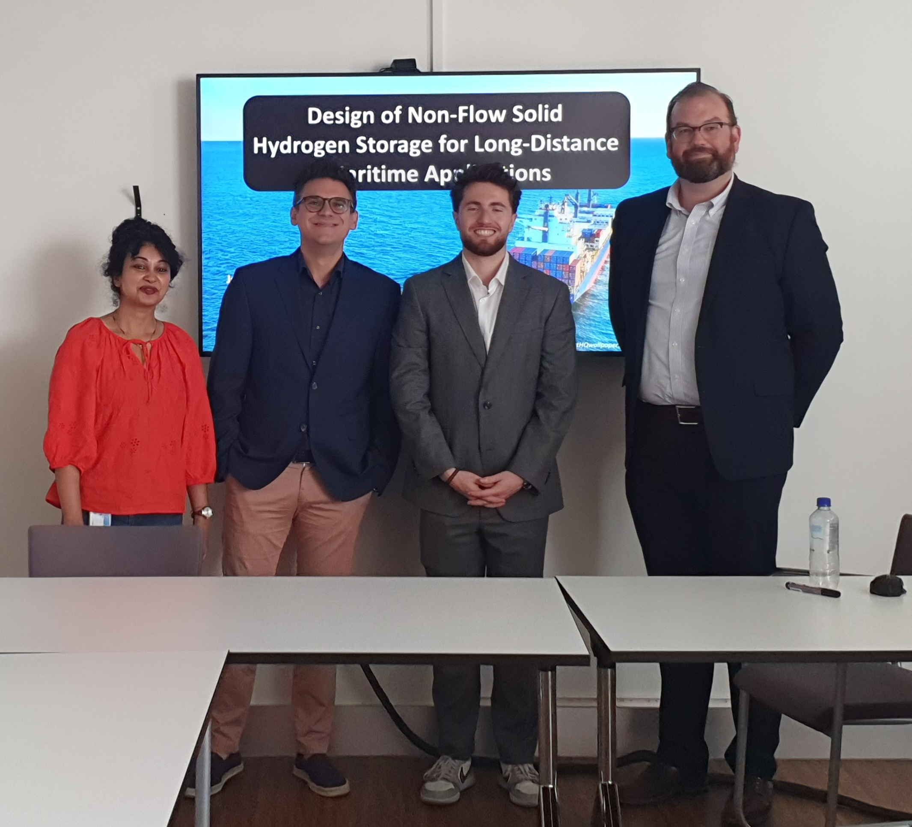

 
Click on photos to enlarge.

<!-- 
 -->

  
  
 From our visit to the waste water treatment plant in Dordrecht with our SYROP team. People from left to right: Otto, Bowen Sha, Gabriele Blassi, Cole Brzakala, Gaston Kroos, Akhilesh Soodan, Kim Lompe, Tiza Spit, René van der Aa. (Rwzi Dordrecht, February 2026)

  
  
 With <a href="https://cbe.princeton.edu/people/athanassios-panagiotopoulos">Thanos Panagiotopoulos</a> during the reception for celebrating his 65th birthday. (Boston MA, USA, November 2025)

  
  
 After the MSc defence of Nikos Tzitzikopoulos. People in the photo from left to right: Nikos, Otto, Mahinder Ramind, Emanuele Zanetti, and Bowei Huang. (Delft, October 2025)

  
  
 From the MSc defence of Anneke Guluma. People in the photo from left to right: Alexandros Vasileiadis, Anneke, Anna Felden, and Otto. (Delft, July 2025)

  
  
 Yet a brand new engineer! Declan Wee Hong Xiang (in the middle). Co-supervised by Jelle Lagerweij (on the left). (Delft, July 2025)

  
  
 Very happy to have shared a few updates about our work on PFAS capture using novel adsorbents at the  <a href="https://www.linkedin.com/feed/update/urn:li:activity:7349211848610586625/">Nanomedicine & Health Tech Symposium</a> organized by Pro2Tech (Delft, July 2025)

  
  
 Jordi Vlak defended his MSc and graduated with 9!  People in the photo from left to right: Luis Cutz, Ahmadreza Rahbari, Jordi and Otto. (Delft, July 2025)

  
  
 Campusrun 2025 ~10 kilometer. This year slower (~53') but with a good company of friends and colleagues (Delft, June 2025)

   
 PhD defence of Parsa Habibi. Committee members: Profs. Michiel Kreutzer, Maarten van der Elst, Doros Theodorou, Biplab Sanyal, and Mahinder Ramdin (reserve member), Thijs Vlugt, and Poulumi Dey.  (Delft, March 2025) 
 

   
 After Menno's succesful MSc thesis defense. People from left to right: Dakar Schlemper, Tim Nijssen, Menno Steverink, Mahinder Ramdin, and Otto. (Delft, February 2025) 
 

   
 Yet another engineer is made! Timman van Oeveren's succesfully defended his MSc on LCA of H2 liquifaction. People from left to right: <a href="https://www.linkedin.com/in/joost-vogtländer-73772536/">Joost Vogtlander </a>, Otto, Mahinder Ramdin, and Timman. (Delft, December 2024) 
 

  
  
 Last week of Fengyi Mi in the office (Delft, October 2024)

  
  
 Another engineer was made! Dimitris Mintsis graduated with a grade of 9. People from left to right: Otto, Burak Eral, Dimitris, and Ahmadreza Rahbari. (Delft, October 2024)

  
  
 With Mert Polat after his PhD defence! (Delft, September 2024)

  
  
 It was our great pleasure and honour to host the 28th edition of the historic Thermodynamics conference in Delft. Many thanks to all the 140 participants for making this a wonderful event, to the sponsors for the support, and Royal Society of Chemistry for the trust. (Delft, 4-6 September 2024)

  
  
 MSc graduation of Debdutta Chatterjee with Cum Laude!!! People from left to right: Lindert van Biert, Otto, Debdutta, Mahinder Ramdin, and Tim Nijssen. (Delft, July 2024)

  
  
 With the whole Engineering Thermodynamics group at glow golf. (Schiedam, June 2024)

  
  
 Who said that designing CO2 capture systems cannot also be fun? Here at the <a href="https://www.gooischebierbrouwerij.nl">Gooische bierbrouwerij</a> with our partners from <a href="https://brew-right.com">BrewRight</a>. (Hilversum, June 2024)

  
  
 With Remco Hartkamp after finishing the Campusrun 2024 10 kilometer run. My time: 50:46 (Delft, June 2024)

  
  
 MSc graduation of Hugo van Leeuwen. People from left to right: Poulumi Dey, Hugo, Otto, Peter van den Broeke (TATASteel) (Delft, April 2024)

  
  
 With <a href="https://www.linkedin.com/in/lili-ma-94e/?originalSubdomain=nl">Lili Ma</a> after her successful PhD defense. (TU Delft, April 2024)

  
  
 With <a href="https://tim-nijssen.nl">Tim Nijssen</a>  in <a href="https://www.kennedyspacecenter.com">Kennedy Space Center</a> (Merritt Island, FL, USA, November 2023)

  
  
 From our visit at <a href="https://totalenergies.com">TotalEnergies</a> headquarters. People from left to right: Otto, Thijs Vlugt, Mert Polat, <a href="https://www.linkedin.com/in/frédérick-de-meyer-aab90538/?originalSubdomain=fr">Frédérick de Meyer</a>, <a href="https://www.linkedin.com/in/céline-houriez-27a00a76/?originalSubdomain=fr">Céline Houriez</a> (Paris, France, September 2023)

  
  
 MSc graduation of Vladimir Jelle Lagerweij. People from left to right: Thijs Vlugt, Parsa Habibi, Jelle, Riccardo Taormina (CiTG), and Otto (Delft, August 2023)

  
  
 MSc graduation of Jose Antonio Gonzalez Morales. People from left to right: Poulumi Dey, Otto, Jose, and Carey Walters (Delft, August 2023)

  
  
 The traditional "Greek photo" at the PPEPPD 2023 conference. People from left to right: Evangelos Drougkas (DTU) <a href="https://orbit.dtu.dk/en/persons/georgios-kontogeorgis">Georgios Kontogeorgis</a> (DTU), <a href="https://www.linkedin.com/in/eirini-karakatsani-665676106/?originalSubdomain=dk">Eirini Karakatsani</a> (Topsoe), <a href="https://cbe.princeton.edu/people/athanassios-panagiotopoulos">Thanos Panagiotopoulos</a> (Princeton), Otto (TU Delft), <a href="https://chbe.ubc.ca/peter-englezos/">Peter Englezos</a> (UBC), <a href="https://www.qatar.tamu.edu/programs/chemical-engineering/faculty-and-staff/dr.-ioannis-economou">Ioannis Economou</a> (TAMUQ). (La Pineda, Spain, May 2023)

  
  
 Otto receiving the <a href="https://ppeppd.org/awards/">Young Researcher Award</a> at the <a href="https://ppeppd.org/ppeppd2023/">PPEPPD 2024</a> conference (La Pineda, Spain, May 2023)

  
  
 With <a href="https://scholar.google.com/citations?user=Sl1Z18sAAAAJ&hl=de">Carlos Vega</a> at Universidad Complutense Madrid (Madrid, Spain, May 2023)

  
  
 Last day of Bin Fang in the office (Delft, February 2023)

  
  
 Group lunch before Christmas. People from left to right: Otto, Jose Antonio Gonzalez Morales, Bin Fang, Lili Ma, Parsa Habibi, and Mert Polat (Delft, December 2022)

  
  
 MSc graduation of Casper van der Geest (Delft, December 2022)

  
  
 Officially announcing that our group will organize the next Thermodynamics conference in TU Delft (Bath, UK, September 2022)

  
  
 At the <a href="https://www.romanbaths.co.uk">Roman Baths</a> during the Thermodynamics 2022 conference in Bath. People from left to right: <a href="https://www.qatar.tamu.edu/programs/chemical-engineering/faculty-and-staff/dr.-ioannis-economou">Ioannis Economou</a>, <a href="https://orbit.dtu.dk/en/persons/georgios-kontogeorgis">Georgios Kontogeorgis</a>, Chrysa Economou, <a href="https://orbit.dtu.dk/en/persons/nefeli-effrosyni-novak">Nefeli Novak</a>, Otto, and Parsa Habibi (Bath, UK, September 2022)

  
  
 MSc graduation of Ke Xu (TU Delft, July 2022)

  
  
 PhD defence of Máté Erdös (TU Delft, June 2022)

  
  
 Making vanilla ice cream together with Thijs Vlugt at the farewell event of our dean Theun Baller. Recipe: 1 lt of milk, 1 lt of cream, 350 g of sugar, 0.5 bottle of vanilla extract, and ...liquid nitrogen. (TU Delft, June 2022)

  
  
MSc graduation of Prateek Jain (TU Delft, June 2022)

  
  
PhD Defence of Hirad Salehi (TU Delft, June 2022)

  
  
Ice cream afternoon for the group! People from left to right: Ke Xu, Lili Ma, Mert Polat, Parsa Habibi, Casper van der Geest, Prateek Jain, Poulumi Dey. Front row: Seyed Jamali, Otto, and Alexandros (Delft, May 2022)

  
  
From our visit to Porelab/NTNU. People from left to right: Ke Xu, Otto, Parsa Habibi, Mert Polat, Bin Fang (Trondheim, Norway, April 2022)

  
  
Oostport, Delft (Delft, January 2022)

  
  
With Mert Polat and Thijs Vlugt from our visit at CTP MINES ParisTech (Fountainbleu, France, Dec 2021)

  
  
MSc graduation of Kunal Mavani (TU Delft, July 2021)

  
  
PhD Defence of Noura Dawass (TU Delft, June 2021)

  
  
From our visit to TAMUQ: In Souq Waqif with Thijs Vlugt and Noura Dawass (Doha, Qatar, November 2019)

  
  
With Peter van den Broeke under the Acropolis (Athens, Greece, July 2019)

  
  
Lunch during the Thermodynamics 2019 conference. People from left to right: Ioannis Tsimpanogiannis, Ioannis Economou, Claire McCabe, Peter Cummings, Amparo Galindo, Chrisa Economou, Otto, Ilias Nikolaidis (Punta Umbria, Spain, June 2019)

  
  
With Thijs Vlugt outside Notre Dame a few days before the fire broke out (Paris, France, April 2019)

  
  
From our visit to Porelab/NTNU. People from left to right: Otto, Signe Kjelstrup, Thijs Vlugt, Michael Rauter, Dick Bedeaux, Olav Galteland, Bjørn Hafskjold (Trondheim, Norway, March 2019)

  
  
With Keichi Kuboyama and Noura Dawass from our visit to Porelab/NTNU. (Trondheim, Norway, March 2019)

  
  
With Max Döpke (left) and Máté Erdös (right) from our visit to UCL (London, UK, September 2018)

  
  
Outside the P&E building experiencing rare weather phenomena! (TU Delft, December 2017)

  
  
MSc graduation of Zsolt Csaszar (TU Delft, October 2017)

  
  
From our visit to Universidad Pablo de Olavide. People from left to right: Otto, Remco Hartkamp, Christos Bardas, Hirad Salehi, Seyed Jamali (Sevilla, Spain, October 2017)

  
  
At the ESAT 2017 conference in Scotland (Edinburgh, UK, September 2017)

  
  
With Máté Erdös (left) and Reza Rahbari (right) during the outing of Process & Energy department at the beach (Kijkduin, The Hague, June 2017)

  
  
At the Indiana dunes state park with lake Michigan in the background (Indiana, USA, June 2016)

  
  
At the TAMUQ campus with (from left to right) Ioannis Tsimpanogiannis, <a href="https://www.linkedin.com/in/panagiotis-krokidas-b2907a89/">Panagiotis Krokidas</a>, and <a href="https://www.linkedin.com/in/researchchemicalengineer/">Nikos Diamantonis</a> (Doha, Qatar, March 2016)

  
  
 At the ESAT 2015 conference in Greece. People from left to right: <a href="https://www.linkedin.com/in/marianna-yiannourakou-4765a65/">Marianna Yiannourakou</a>, Ioannis Tsimpanogiannis, <a href="https://scholar.google.gr/citations?hl=en&user=8MjGyYwAAAAJ&view_op=list_works&sortby=pubdate">Georgios Boulougouris</a>, Otto, <a href="https://www.linkedin.com/in/ilias-nikolaidis-931554205/">Ilias Nikolaidis</a>, <a href="https://www.linkedin.com/in/vasileios-michalis-54301148/">Vasilis Michalis</a>, Zoi Makrodimitri, <a href="https://inn.demokritos.gr/person/loukas-d-peristeras/">Loukas Peristeras</a>, <a href="https://www.qatar.tamu.edu/programs/chemical-engineering/faculty-and-staff/dr.-ioannis-economou">Ioannis Economou</a>, and <a href="https://inn.demokritos.gr/person/niki-vergadou/">Niki Vergadou</a> (Athens, Greece, June 2015)

  
  
 AZP group dinner. People from left to right: Mike Howard, Joey Vella, Arash Nikoubashman, AZP, Mirjana Zoric, Nate Mahynski, Zoltan Mester, Andrew Santos, Kevin Daly, Gustavo Orozco, Otto (Princeton NJ, Usa, June 2014)

  
  
Playing basketball with colleagues <a href="https://www.linkedin.com/in/zoltan-mester-4636a810/">Zoltan Mester</a> and <a href="https://www.linkedin.com/in/andrew-p-santos/">Andrew Santos</a> (Princeton NJ, Usa, May 2014)

<!-- 

  
  
 New York City (Manhattan, NY, August 2014)

 -->

  
  
An afternoon at the Sandia Peak during the <a href="https://www.lammps.org/workshops/Aug13/Aug13_workshop.html">LAMMPS Users' Workshop and Symposium</a> (Albuquerque NM, USA, September 2013)

  
  
Thermodynamics 2013 conference dinner at Manchester's city hall with Ioannis Tsimpanogiannis (Manchester, UK, September 2013)

<!-- 
 -->

<!-- Photo Lightbox Modal -->

  

    

      

        
      

    

  

