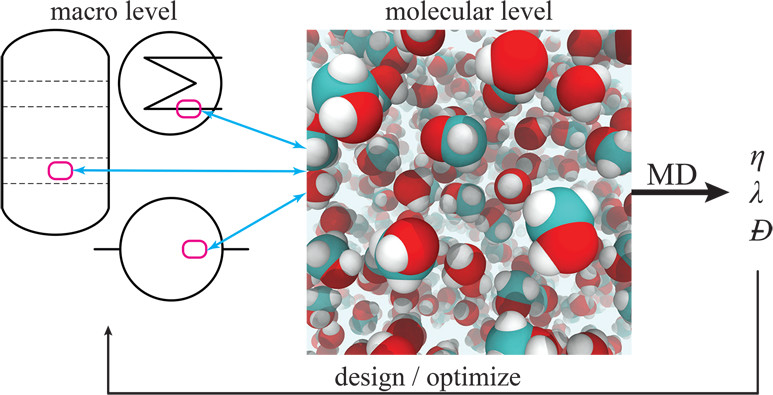
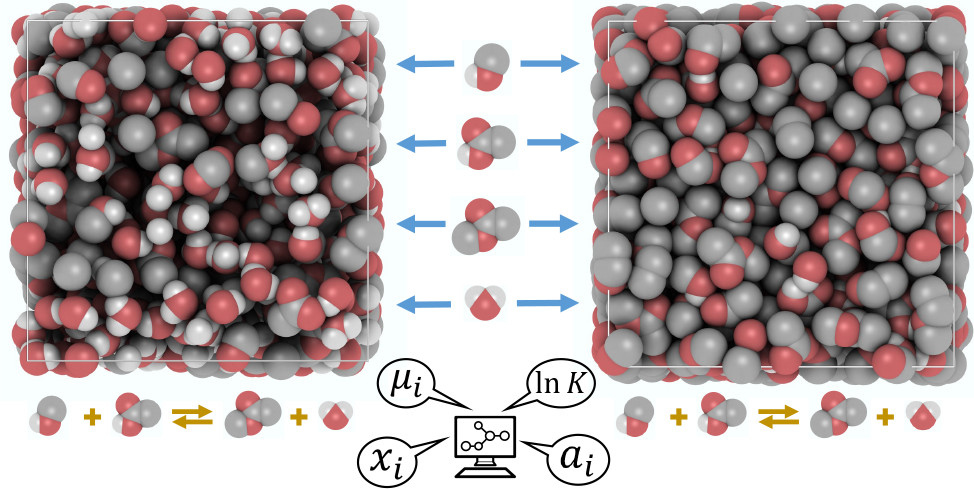
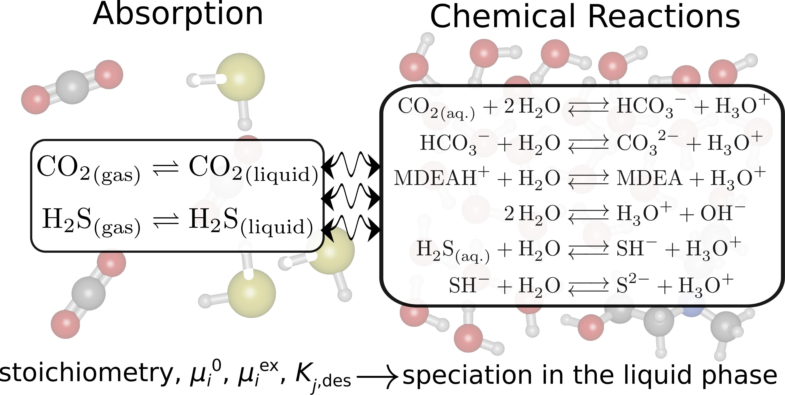
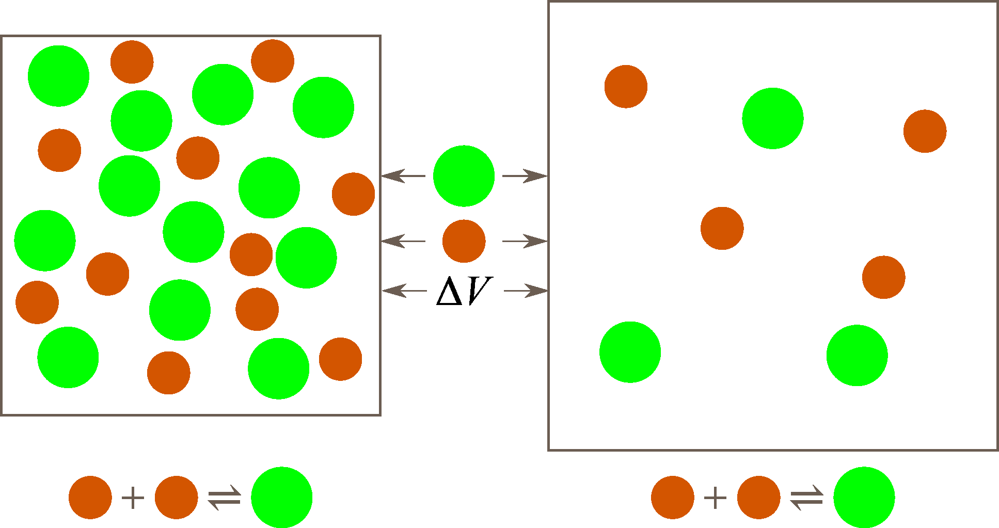

  <h3>Open-source Software Developed in Our Group</h3>
  

    <!-- OCTP -->
    

      <h4>OCTP: A Tool for On-the-Fly Calculation of Transport Properties</h4>
      

        <a href="https://github.com/omoultosEthTuDelft/OCTP"> Code</a>
        <a href="https://pubs.acs.org/doi/10.1021/acs.jcim.8b00939"> Publication</a>
      

      

        
      

    

    <!-- BRICK -->
    

      <h4>Brick-CFCMC: Monte Carlo Simulations of Phase and Reaction Equilibria</h4>
      

        <a href="https://gitlab.com/ETh_TU_Delft/Brick-CFCMC"> Code</a>
        <a href="https://pubs.acs.org/doi/10.1021/acs.jcim.0c00334"> Publication</a>
      

      

        
      

    

    <!-- CASpy -->
    

      <h4>CASpy: Open Source Solver for Chemical Reaction and Absorption Equilibria</h4>
      

        <a href="https://github.com/omoultosEthTuDelft/CASpy"> Code</a>
        <a href="https://pubs.acs.org/doi/full/10.1021/acs.jctc.3c00144"> Publication</a>
      

      

        
      

    

    <!-- RE/GE -->
    

      <h4>RE/GE MC: Monte Carlo Code for Simulations in Reaction/Gibbs Ensemble</h4>
      

        <a href="https://github.com/omoultosEthTuDelft/Reaction-Gibbs-Ensemble-Monte-Carlo"> Code</a>
        <a href="https://doi.org/10.1016/j.fluid.2024.114084"> Publication</a>
      

      

        
      

    

  

