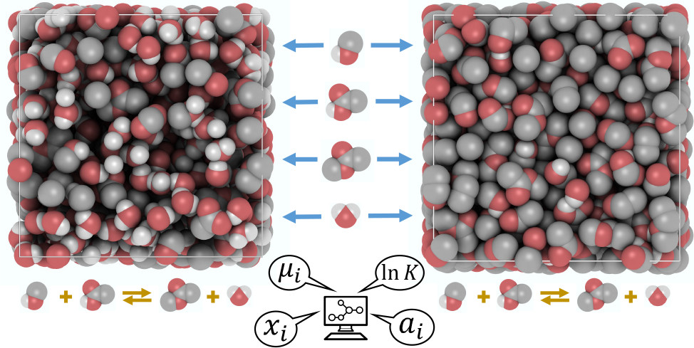

  <h3>Open-source Software Developed in Our Group</h3>

  <!-- OCTP -->
  

    <h4>OCTP: A Tool for On-the-Fly Calculation of Transport Properties of Fluids with the Order-n Algorithm in LAMMPS</h4>
    <a href="https://github.com/omoultosEthTuDelft/OCTP"> Code</a>
    <a href="https://pubs.acs.org/doi/10.1021/acs.jcim.8b00939"> Publication</a>
    

      
    

  

  

  <!-- BRICK -->
  

    <h4>Brick-CFCMC: Open Source Software for Monte Carlo Simulations of Phase and Reaction Equilibria Using the Continuous Fractional Component Method</h4>
    <a href="https://gitlab.com/ETh_TU_Delft/Brick-CFCMC"> Code</a>
    <a href="https://pubs.acs.org/doi/10.1021/acs.jcim.0c00334"> Publication 1</a> & <a href="https://doi.org/10.1021/acs.jcim.1c00652">Publication 2</a>
    

      
    

  

  

  <!-- CASpy -->
  

    <h4>CASpy: Open Source Solver for Chemical Reaction and Absorption Equilibria</h4>
    <a href="https://github.com/omoultosEthTuDelft/CASpy"> Code</a>
    <a href="https://pubs.acs.org/doi/full/10.1021/acs.jctc.3c00144"> Publication</a>
    

      
    

  

  

  <!-- RE/GE -->
  

    <h4>RE/GE MC: Monte Carlo Code for Performing Simulations in the Combined Reaction/Gibbs Ensemble</h4>
    <a href="https://github.com/omoultosEthTuDelft/Reaction-Gibbs-Ensemble-Monte-Carlo"> Code</a>
    <a href="https://doi.org/10.1016/j.fluid.2024.114084"> Publication</a>
    

      
    

  

